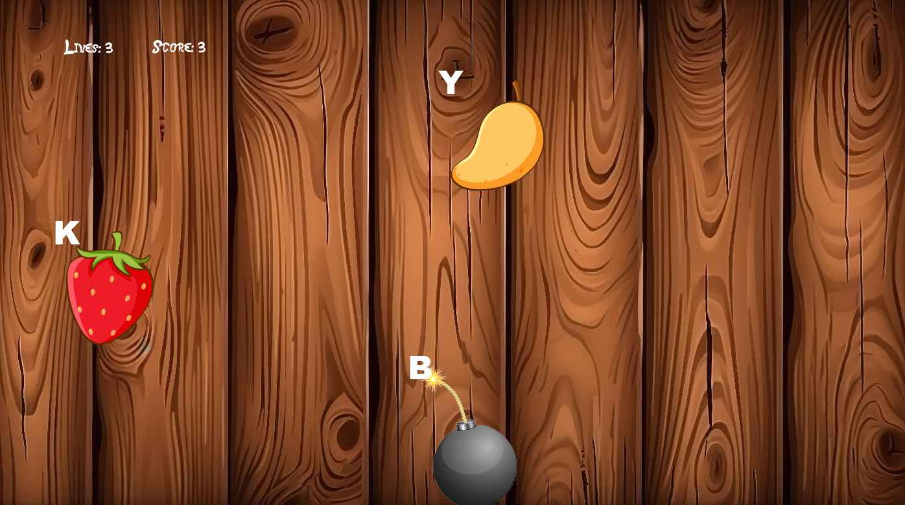

# Fruit Ninja Slicer

## **Introduction**

Fruit Ninja Slicer is a typing game how the aim is to slice all the fruits
who appear in the game screen while avoiding cutting bombs.
You will use keyboard's letters to cut the fruits whose letter displayed 
on the screen is the same as the one you just pressed on your keyboard.
In this game, you can also cut ice cubes to freeze the screen and win some
useful seconds to slice all the fruits which are still on the screen.
You can choose between three levels of difficulty, and to play the game in
English or in French.
This game is created using the PyGame library of Python.

- Language used: Python
- Libraries used: PyGame, random

## **Installation**

To install Fruit Ninja Slicer, follow these steps:

1. Clone this repository: **`git clone https://github.com/lorenzo-ottaviani/typing-game`**
2. Download the Python language: **https://www.python.org/downloads/**
3. Install the PyGame library: **`pip install pygame`**
4. Navigate to the project directory: **`cd typing-game`**

## **Usage**

To use Fruit Ninja Slicer, follow these steps:

1. Open the computer terminal.
2. Navigate to the project directory: **`cd typing-game`**
3. Launch the app.py file: **`py main.py`** or **`python main.py`** or **`python3 main.py`**
4. Play the game.

## **License**

Fruit Ninja Slicer is released under the Apache-2.0 License. 
See the **[LICENSE](http://www.apache.org/licenses/LICENSE-2.0)** file for details.

## **Authors and Acknowledgment**

Fruit Ninja Slicer was created by :

- **[Thibault CARON](https://github.com/thibault-caron)**
- **[Lorenzo OTTAVIANI](https://github.com/lorenzo-ottaviani)**
- **[Olivier PORTAL](https://github.com/olivier-portal)**

Thank you to all the contributors for their hard work and dedication to the project.

